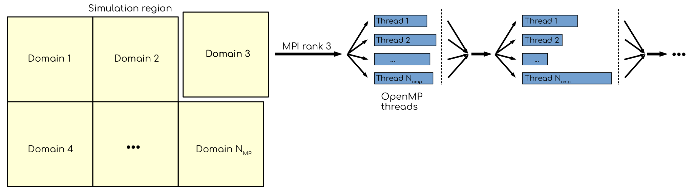

Using CPUs efficiently
======================

.. questions::

   - Should I use MPI ranks or OpenMP threads?
   - Single trajectory performance vs. high throughput.

.. objectives::

   - Understand the difference between MPI ranks and OpenMP threads.
   

MPI ranks and OpenMP threads
----------------------------

In GROMACS, there are two ways to explore parallelism on a CPU.
The first one is using domain decomposition: the simulation volume is
divided over several regions, called domains. Each domain is assigned
to an MPI rank. Ranks communicate when needed. Second, more granular way
is by using OpenMP threads, which are spawned within the ranks when there
is extra parallelism to explore. Indeed, each domain contains more than one
particle, each of which can be propagated independently in independent thread.

   Domains, MPI ranks and OpenMP threads. Simulation region is divided into
   parts, called domains. Each domain is mapped to an MPI rank, which handles
   computations for particles within domain. The ranks communicate with each
   other, sending and receiving the data in the bordering (or halo) regions.
   More fine-grained parallelism can be explored with OpenMP threads, that
   allow to compute for different particles within single domain simultaneously.

Let us explore the two ways of using many cores on a CPU. We are not going to use
the entire node of the cluster, but only cores that correspond to a single GPU.
On Puhti, this is 10 CPU cores.

.. challenge:: Explore performance with MPI and OpenMP

   We start with the following job script.

   .. code-block:: bash

      #!/bin/bash

      #SBATCH --time=00:15:00
      #SBATCH --partition=test
      #SBATCH --ntasks=XX
      #SBATCH --cpus-per-task=YY
      #SBATCH --account=project_2003752

      module purge
      module load gromacs-env/2021-gpu
      export OMP_NUM_THREADS=$SLURM_CPUS_PER_TASK

      srun gmx_mpi mdrun -ntomp $SLURM_CPUS_PER_TASK -nsteps 20000 -resetstep 19000

   1. Modify the script so it will use all 10 cores as MPI ranks.

   2. Modify the script so it will use all 10 cores as OpenMP threads.

   3. Try some intermediate values, when there are both MPI ranks and OpenMP threads.

.. solution::

   1.:
      .. code-block:: bash

         #!/bin/bash

         #SBATCH --time=00:15:00
         #SBATCH --partition=test
         #SBATCH --ntasks=10
         #SBATCH --cpus-per-task=1
         #SBATCH --account=project_2003752

         module purge
         module load gromacs-env/2021-gpu
         export OMP_NUM_THREADS=$SLURM_CPUS_PER_TASK

         srun gmx_mpi mdrun -ntomp $SLURM_CPUS_PER_TASK -nsteps 20000 -resetstep 19000

   2.:
      .. code-block:: bash

         #!/bin/bash

         #SBATCH --time=00:15:00
         #SBATCH --partition=test
         #SBATCH --ntasks=1
         #SBATCH --cpus-per-task=10
         #SBATCH --account=project_2003752

         module purge
         module load gromacs-env/2021-gpu
         export OMP_NUM_THREADS=$SLURM_CPUS_PER_TASK

         srun gmx_mpi mdrun -ntomp $SLURM_CPUS_PER_TASK -nsteps 20000 -resetstep 19000
   
   3. For example:

      .. code-block:: bash

         #!/bin/bash

         #SBATCH --time=00:15:00
         #SBATCH --partition=test
         #SBATCH --ntasks=5
         #SBATCH --cpus-per-task=2
         #SBATCH --account=project_2003752

         module purge
         module load gromacs-env/2021-gpu
         export OMP_NUM_THREADS=$SLURM_CPUS_PER_TASK

         srun gmx_mpi mdrun -ntomp $SLURM_CPUS_PER_TASK -nsteps 20000 -resetstep 19000

Note the following line in the ``gmx mdrun`` output:

.. code-block::

   Non-default thread affinity set, disabling internal thread affinity

This means that the threads are not pinned to the computational cores. So the execution can jump from one core to another,
and from one NUMA domain to the other. This can be very inefficient, because data locality will be broken. to overcome this,
one can enforce thread pinning using ``-pin on`` and ``-pinstride 1`` options of ``gmx mdrun``. The first option enforces
thread pinning, the second --- sets how they should be distributed over the cores (1 means consecutive). Note that on the
systems where Simultaneous multithreading (SMT) is enabled, one may want to explore ``-pinstride 2`` option, only running
on physical cores.

Ensemble runs as an efficient way to use computational resources
----------------------------------------------------------------

.. challenge:: What with the scaling?

   1. Let us see how good is the scaling for our system. Use the most performant job script from the previous example and run simulations using
      5, 10 and 20 cores. How far is it from linear?

   2. Use the provided ``create_inputs.sh`` script to create inputs for ensemble run.

   3. Modify script so it will use 5 cores per run but will run 2 and 4 trajectories. What is the cumulative performance (number of runs times ns/day)?

.. solution::

   For the system that we are using (~5000 atoms), the scaling is sub-optimal, with twice as many cores giving ~50% performance gain. Note that the scaling will be better for bigger MD systems.
   
   Script for two runs:

   .. code-block:: bash

         #!/bin/bash

         #SBATCH --time=00:15:00
         #SBATCH --partition=test
         #SBATCH --ntasks=10
         #SBATCH --cpus-per-task=1
         #SBATCH --account=project_2003752

         module purge
         module load gromacs-env/2021-gpu
         export OMP_NUM_THREADS=$SLURM_CPUS_PER_TASK

         srun gmx_mpi mdrun -ntomp $SLURM_CPUS_PER_TASK -nsteps 20000 -resetstep 19000 -pin on -pinstride 1 -multidir ensemble_inputs/repl_01 ensemble_inputs/repl_02

.. keypoints::

   - The way CPU cores are used may affect performance
   - Running en ensemble scales.
