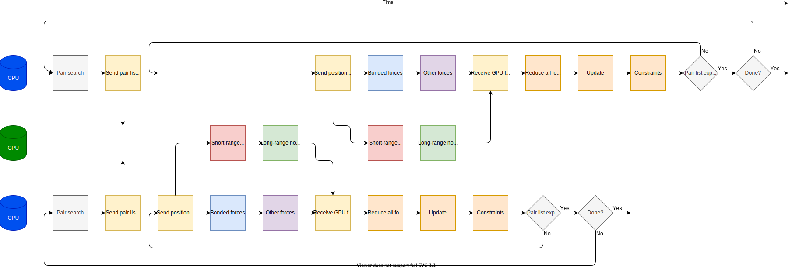

General considerations for performance
======================================

.. questions::

   - What things should I think about while setting up each simulation?

.. objectives::

   - Know common pitfalls to avoid

Designing an efficient simulation
---------------------------------

Here's a short list of things to consider when designing your
simulations, so that you will run efficiently.

* Choose a simulation cell that is the right shape, just large enough for your science and your physical model
* Otherwise, use LINCS and h-bonds constraints and 2 fs time steps
* Be aware that typical water models are designed to be rigid
* Use fast 3-site water models unless there's a clear scientific reason
* If your simulation has layers, align them to the X-Y plane, so that
  the automatic load balancing division along the Z axis works well
* If your simulation cell has some dimensions much shorter than the others,
  choose the short one(s) to be X and Y for the same reason as above.
* Write only the output you know you will use - if you don't know what output
  you will use, don't run a simulation yet!
* Write the output you need with a period that makes sense - no shorter
  than its autocorrelation time.
* Don't run your production simulation with energy output groups on -
  if you need that later, it's much more efficient to use ``gmx mdrun -rerun``
* Don't use temperature or pressuring coupling every step
* Choose ``nst*`` parameters to have a large common factor, like 10 or 100
* Use h-bond constraints and a timestep around 2 fs

Do you need speed or throughput?
--------------------------------

Sometimes you simply need one trajectory to run as fast as
possible. But often one's scientific goals are best met by running
several similar trajectories. Perhaps even the same system
equilibrated from different starting velocities. If aggregate sampling
across multiple trajectories is what you need, then multi-simulations
can be very efficient.

These exploit the fact that the two trajectories are themselves
concurrent. When running a single trajectory, the GPU is idle when the
update and constraints run on the GPU. However if two trajectories
run, sharing the same GPU, then they will settle in a pattern running
mutually "out of phase" with each other. While one trajectory is doing
the update on the CPU, the other is computing its forces on the
GPU. Neither trajectory will be as fast as if they had the resources
to themselves, but the overall sampling rate will be much higher than
the single trajectory.

   Sharing the GPU between two trajectories. While one trajectory is
   doing the update phase on the CPU, the other trajectory will use
   the GPU, which would otherwise lie idle. This maximizes resource
   utilization. Each trajectory needs its own (dedicated) CPU
   cores. It might be best to only offload the short-range work to the
   GPU, do experiment!

This possiblity exists only because there are resources that remain
idle that can be used in parallel between two trajectories. Thus there
is no advantage from sharing more than two trajectories per GPU, and
no such advantage where there is no GPU in use.

It is possible to do this manually with ``gmx mdrun`` if you take care
to give each trajectory its own CPU cores and share the GPU. However,
the multi-simulation feature in ``gmx_mpi mdrun -multidir`` will take
care of these details for you. For example, for four trajectories, each
with one rank, on a single node with two GPUs, consider using

::

   mpirun -np 4 gmx_mpi mdrun -multidir A/ B/ C/ D/

which will share GPU #0 between A and B and GPU #1 between C and D.

See also
--------

This paper "Heterogeneous parallelization and acceleration of molecular dynamics simulations in GROMACS"
https://doi.org/10.1063/5.0018516 (or https://arxiv.org/abs/2006.09167) has useful information.

These papers explore multi-simulations for throughput in detail:

* "More bang for your buck: Improved use of GPU nodes for GROMACS 2018" https://doi.org/10.1002/jcc.26011
* "Best bang for your buck: GPU nodes for GROMACS biomolecular simulations" https://doi.org/10.1002/jcc.24030

.. keypoints::

   - The ``mdrun`` implementation is not fully general, some things run faster than others
