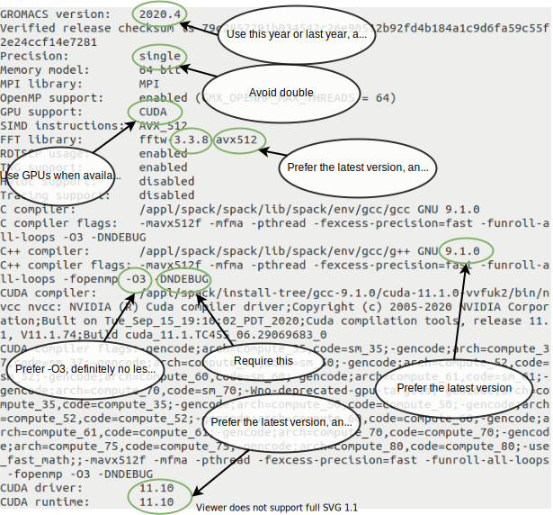

Introduction
=============================================

.. questions::

   - Why is getting good performance important?
   - When should I not care about getting good performance?

.. objectives::

   - Know the scientific value of GROMACS performance
   - Know the human value of getting "good enough" performance

Why do we need good performance from GROMACS
--------------------------------------------

Molecular dynamics simulations iteratively solve equations of motion
to sample a thermodynamic ensemble. Particle positions are used to
compute forces, which update velocities, which in turn update the
positions to new values. This procedure iterates often billions of
times. Eventually we will sample all parts of the ensemble,
ie. "solve" the equations of motion.

The time steps involved are normally femtoseconds, however we normally
want to make conclusions about macroscopic observables that change
much more slowly. Since we need to make very many observations to have
a statistically relevant sampling from the ensemble, it's important to
make sure that each of those tiny time steps is computed as
efficiently as possible. The more observations you make, the more
likely your scientific conclusions are reliable. That is why so much
effort has gone into engineering GROMACS to compute those as
efficiently as possible. Your compute budget is probably limited and
you want to get the best value from it.

If you just run `gmx mdrun` then it looks at your simulation and the
available hardware and does an OK job at guessing what might be best.
Sometimes it tries some alternative equivalent approaches and uses the
most efficient one. Unfortunately the range of possible simulations
and available hardware is huge, so the automation often doesn't get
the best result. Sometimes you need to get involved and guide the
choice.

When do we *not* care about performance/efficiency?
---------------------------------------------------

There's a trade-off between human time and computer time. Computers are
cheaper than humans, and it can be a false economy to spend a lot of
human time in order to work out how to use less computer time.

* If it's a very short-lived task, like the minimization and
  equilibration phases of an MD simulation, then generally you should
  just accept the default performance.
* If it's a something you will do only once, don't worry much about
  optimizing it.
* If you're just beginning your work with GROMACS, focus on learning
  new things, not maximizing performance.

Rule of thumb: Unless you're going to run the same kind of simulation
on the same hardware for more than a week, reading another paper or
designing another simulation will be a better use of your time than
playing with anything in this tutorial. The computer can do your
simulation in the background and you've done something profitable in
the meantime.

Easy global wins
----------------

When performance matters, you should be running `mdrun` on a cluster
where the sysadmins have typically done a good job installing GROMACS
for you. But maybe your sysadmin is an over-worked postdoc,
etc. `mdrun` reports in the log file how it was built, and it is worth
knowing what to look for, so you can either suggest an improvement or
do it yourself. This will improve things every time you run `mdrun`.
You can also see this output from ``gmx -version`` or ``gmx_mpi
-version``.

Key points:

* seek to use the latest version of compilers, GPU drivers, GPU libraries
* check the log file for warnings that GROMACS could be configured
  better for your hardware
* don't use a version compiled with double precision unless you know
  a specific reason why you need to

   Checking the build configuration of GROMACS will run fast.

  
See also
--------

Check
https://manual.gromacs.org/current/user-guide/mdrun-performance.html#gromacs-configuration
for the current list of suggestions from the GROMACS developers.

.. keypoints::

   - Consider optimizing long-running production simulations
   - Otherwise, go do something with scientific value!
