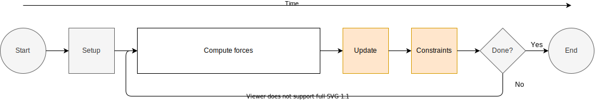
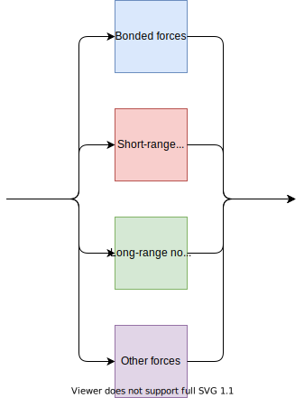
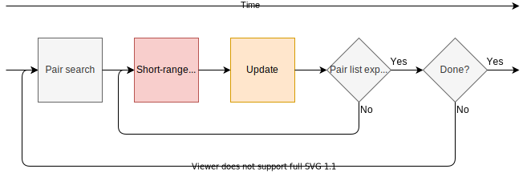

Getting performance from the MD algorithm
=========================================

.. questions::

   - What aspects of the MD algorithm are most important for performance?
   - What do I need to know as a user to understand the performance?

.. objectives::

   - Be able to name the most important parts of the MD workflow
   - Appreciate some of the internal architecture of `mdrun`

Workflow within an MD simulation
--------------------------------

   Stages of the iterative pipeline that is implemented by molecular dynamics engines like `mdrun`

How long it takes to compute a stage of the pipeline depends on two factors:

* how fast the arithmetic needs to be done
* how fast the data moves to where it needs to be

The latter gets harder when GPUs are involved, because they are
physically separated from the CPU. Fortunately, they also tend to make
the former possible to make faster. Unfortunately, which one dominates
is hard to analyse in general. The amount of arithmetic varies for
each simulation system, and how long it would take to move the data
somewhere else to do the arithmetic isn't known in advance. Diversity
makes our lives hard, both as users and developers!

The good news is that most of the arithmetic is in the force
calculation, so there is a natural place to focus effort.

How do GPUs help?
-----------------

These are electronic devices that are massively parallel, often with
thousands of identical compute units ready to all do the same thing.
This was developed for the challenge of rending complex images onto
computer screens, but the good work done there has also been built
upon to do more general computation.

Before *parallelism* helps, we need to know that there is
*concurrency*, ie that there are independent pieces of work that can
be separated out. This is the same challenge we see in human teams...
if Mary can't start her work until Dinesh is done his piece, then
those pieceds of work are not concurrent. Hopefully, Mary has
something else to do in the meantime until Dinesh is finished. But
if not, the team is inefficient. Does MD have concurrency?

Fortunately, the the forces we need to compute naturally come in a
few classes, and those happen to be concurrent.

   MD force fields use different components to describe different
   kinds of chemical interactions. Each has a set of static parameter
   data used to compute forces based on the positions. Those
   computations don't depend on each other, so they are concurrent and
   may be parallelised.

Short-ranged non-bonded forces
------------------------------

For some kinds of system, it is enough to model the non-bonded forces
by treating only short-ranged interactions. Because the Coulomb
interaction between particles decays as :math:`\frac{1}{r}` for distance
:math:`r`, after a certain distance the interactions become
neglible. Cancellation from similar contributions on the other side of
a particle also helps here.

The simplest way to do this is to loop over all pairs of particles and
compute the interactions only when :math:`r` is within a
pre-determined range. This works, but is highly inefficient, because
the particles move slowly enough that it's almost the same interacting
set each time. Its cost also scales with the square of the number of
particles :math:`N`, which is poor when :math:`N` becomes large. So,
instead a *pair list* is formed of particles that are close enough to
interact (sometimes called a *Verlet list* or *neighbor list*). That
pair list is re-used for many MD steps, until the diffusion of
particles makes it necessary to rebuild it. It is also nice that this
scales only with :math:`N`, too.

   Molecular dynamics workflow for a system with only short-ranged
   non-bonded interactions.

Particles still diffuse across the boundary at each step, so GROMACS
adds a buffer to the required interaction distance when building the
list. At each step, the distance is checked when actually deciding
whether to add the interaction to the forces. That is a source of
inefficiency, but to do better we'd have to recompute the pair list
more often, and that turns out to hurt more than helps! GROMACS will
automatically determine a buffer size for you, based on your choice of
an acceptable amount of drift in the total energy (see
https://manual.gromacs.org/current/reference-manual/algorithms/molecular-dynamics.html#energy-drift-and-pair-list-buffering). The
default values are quite defensive, but it is not recommended to
change them because any performance benefit will be slight.

TODO exercise: run RF with different buffer sizes

TODO remove or fix challenge

.. challenge:: 1.2 Quiz: if one rank calls a reduce,
   and another rank calls a broadcast, is it a problem?

   1. Yes, always.

   2. No, never.

   3. Yes when they are using the same communicator

.. solution::

   3. Yes

See also
--------

.. keypoints::

   - Concurrent force calculations can be computed in parallel
   - GROMACS handles buffered short-range interactions automatically for you
