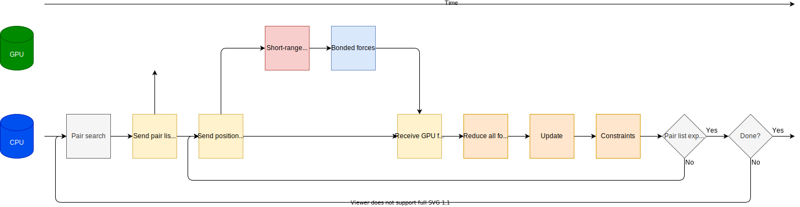

Getting performance from the MD algorithm
=========================================

.. questions::

   - What aspects of the MD algorithm are most important for performance?
   - What do I need to know as a user to understand the performance?

.. objectives::

   - Be able to name the most important parts of the MD workflow
   - Appreciate some of the internal architecture of `mdrun`

Workflow within an MD simulation
--------------------------------

.. figure:: img/molecular-dynamics-workflow.svg
   :align: center

   Stages of the iterative pipeline that is implemented by molecular dynamics engines like `mdrun`

How long it takes to compute a stage of the pipeline depends on two factors:

* how fast the arithmetic needs to be done
* how fast the data moves to where it needs to be

The latter gets harder when GPUs are involved, because they are
physically separated from the CPU. Fortunately, they also tend to make
the former possible to make faster. Unfortunately, which one dominates
is hard to analyse in general. The amount of arithmetic varies for
each simulation system, and how long it would take to move the data
somewhere else to do the arithmetic isn't known in advance. Diversity
makes our lives hard, both as users and developers!

The good news is that most of the arithmetic is in the force
calculation, so there is a natural place to focus effort.

How do GPUs help?
-----------------

.. figure:: img/MPIandOpenMPandGPU.png
   :align: center

   Using GPUs in addition to MPI ranks and OpenMP threads to explore parallelism.
   Many GPU threads can significantly speed-up the evaluation of compute-intense tasks.
   However, to get the best out of it, the domain has to contain thousands to tens of thousands
   off particles.   

GPUs are electronic devices that are massively parallel, often with
thousands of identical compute units ready to all do the same thing.
This was developed for the challenge of rendering complex images onto
computer screens, but the good work done there has also been built
upon to do more general computation.

Before *parallelism* helps, we need to know that there is
*concurrency*, ie that there are independent pieces of work that can
be separated out. This is the same challenge we see in human teams...
if Mary can't start her work until Dinesh is done his piece, then
those pieces of work are not concurrent. Hopefully, Mary has
something else to do in the meantime until Dinesh is finished. But
if not, the team is inefficient. Does MD have concurrency?

Fortunately, the the forces we need to compute naturally come in a
few classes, and those happen to be concurrent.

.. figure:: img/forces-concurrency.svg
   :align: center

   MD force fields use different components to describe different
   kinds of chemical interactions. Each has a set of static parameter
   data used to compute forces based on the positions. Those
   computations don't depend on each other, so they are concurrent and
   may be parallelised.

Moving the most computationally intensive force-computation tasks to
the GPU will let us exploit parallelism to compute faster.

.. challenge:: 2.1 Quiz: What is the best reason for moving the
   *most* computationally expensive tasks to the GPU?

   1. CPUs cost more than GPUs

   2. GPUs are good for computationally expensive tasks

   3. They are the simplest to write GPU code for

   4. It makes room for running many different kinds of
      tasks on the CPU in parallel with the GPU

.. solution::

   4. Given that GROMACS already had a fast CPU implementation, moving
      the biggest workload to the GPU provides the best
      parallelism. There are grains of truth in the other answers,
      however.

Short-ranged non-bonded forces
------------------------------

For some kinds of system, it is enough to model the non-bonded forces
by treating only short-ranged interactions. Because the Coulomb
interaction between particles decays as :math:`\frac{1}{r}` for distance
:math:`r`, after a certain distance the interactions become
neglible. Cancellation from similar contributions on the other side of
a particle also helps here.

The simplest way to do this is to loop over all pairs of particles and
compute the interactions only when :math:`r` is within a
pre-determined range. This works, but is highly inefficient, because
the particles move slowly enough that it's almost the same interacting
set each time. Its cost also scales with the square of the number of
particles :math:`N`, which is poor when :math:`N` becomes large. So,
instead a *pair list* is formed of particles that are close enough to
interact (sometimes called a *Verlet list* or *neighbor list*). That
pair list is re-used for many MD steps, until the diffusion of
particles makes it necessary to rebuild it. It is also nice that this
scales only with :math:`N`, too.

.. figure:: img/molecular-dynamics-short-range-and-pair-lists.svg
   :align: center

   Molecular dynamics workflow for a system with only short-ranged
   non-bonded interactions.

Particles still diffuse across the boundary at each step, so GROMACS
adds a buffer to the required interaction distance when building the
list. At each step, the distance is checked when actually deciding
whether to add the interaction to the forces. That is a source of
inefficiency, but to do better we'd have to recompute the pair list
more often, and that turns out to hurt more than helps! GROMACS will
automatically determine a buffer size for you, based on your choice of
an acceptable amount of drift in the total energy (see
https://manual.gromacs.org/current/reference-manual/algorithms/molecular-dynamics.html#energy-drift-and-pair-list-buffering). The
default values are quite defensive, but it is not recommended to
change them because any performance benefit will be slight.

Further, it turns out that pair lists of single particles run slower
than pair lists of *clusters* of particles. Small clusters of
particles are normally either all interacting with each other, or all
not interacting with each other, just like particles. Moving the data
for the computation from memory to the compute unit is more efficient
with small clusters, so GROMACS does it that way. The clusters have
nothing to do with molecules or bonds, merely that the particles in
them are close together. On GPUs, it turns out to be most efficient
to group those clusters into clusters of clusters, also!

   Illustration of clusters of four particles. Left panel: CPU-centric
   setup. All clusters with solid lines are included in the pair list
   of cluster i1 (green). Clusters with filled circles have
   interactions within the buffered cutoff (green dashed line) of at
   least one particle in i1, while particles in clusters intersected
   by the buffered cutoff that fall outside of it represent an extra
   implicit buffer. Right panel: hierarchical super-clusters on
   GPUs. Clusters i1--i4 (green, magenta, red, and blue) are grouped
   into a super-cluster. Dashed lines represent buffered cutoffs of
   each i-cluster. Clusters with any particle in any region will be
   included in the common pair list. Particles of j-clusters in the
   joint list are illustrated by discs filled in black to gray; black
   indicates clusters that interact with all four i-clusters, while
   lighter gray shading indicates that a cluster only interacts with
   1--3 i-cluster(s), e.g., jm only with i4. Image used with permission
   from https://doi.org/10.1063/5.0018516.

Bonded forces
-------------

Many interesting systems feature particles that have chemical bonds
that are not modelled well by non-bonded interactions. These require
evaluating quite different mathematical functions from the non-bonded
interactions, so they make sense to execute separately. These can also
be evaluated on either the CPU or the GPU.

.. figure:: img/molecular-dynamics-workflow-short-range-gpu-bonded-cpu.svg
   :align: center

   Workflow with short-ranged on the GPU and bonded on the CPU. This
   is the default behavior in GROMACS, and can be selected with ``gmx
   mdrun -nb gpu -bonded cpu``.

   Workflow with both short-ranged and bonded on the GPU. This can be
   selected with ``gmx mdrun -nb gpu -bonded gpu``.

Now there are two different ways we can run on the GPU. One exploits
parallelism with the CPU, and one does not.

.. challenge:: 2.2 Quiz: When would it be most likely to benefit
               from moving bonded interactions to the GPU?

   1. Few bonded interactions and relatively weak CPU
   2. Few bonded interactions and relatively strong CPU
   3. Many bonded interactions and relatively weak CPU
   4. Many bonded interactions and relatively strong CPU

.. solution::

   3. Running two tasks on the GPU adds overhead there, and that
      offsets any benefit from speeding up the bonded work by running
      it on the GPU. If the CPU is powerful enough to finish the
      bonded work before the GPU finishes the short-ranged work, then
      exploiting the CPU-GPU parallelism is best.

.. challenge:: Explore performance with bonded interactions

   Make a new folder for this exercise, e.g. ``mkdir
   performance-with-bonded; cd performance-with-bonded``.
   
   :download:`Download the run input file
   <exercises/performance-with-bonded/topol.tpr>` prepared to do 50000
   steps of a reaction-field simulation. We'll use it to experiment
   with task assignment.

   :download:`Download the job submission script
   <exercises/performance-with-bonded/script.sh>` where you will see
   several lines marked ``**FIXME**``. Remove the ``**FIXME**`` to
   achieve the goal stated in the comment before that line. You will
   need to refer to the information above to achieve that. Save the
   file and exit. Note that this script was designed to run on the
   Puhti cluster. If you are not running on Puhti, then you will need
   to make further changes to this file. Check the documentation for
   how to submit jobs to your cluster!

   Submit the script to the SLURM job manager with ``sbatch
   script.sh``. It will reply something like ``Submitted batch job
   4565494`` when it succeeded. The job manager will write terminal
   output to a file named like ``slurm-4565494.out``. It may take a
   few minutes to start and a few more minutes to run.

   While it is running, you can use ``tail -f slurm*out`` to watch the
   output. When it says "Done" then the runs are finished. Use Ctrl-C
   to exit the ``tail`` command that you ran.

   The ``*.log`` files contain the performance (in ns/day) of each run
   on the last line. Use ``tail *log`` to see the last chunk of each
   log file. Examine the performance in ns/day for each trajectory.
   Have a look through the log files and see what you can learn.

.. solution::

   You can download a :download:`working version
   <answers/performance-with-bonded/script.sh>` of the batch
   submission script. Its diff from the original is file

   .. literalinclude:: answers/performance-with-bonded/script.sh
      :diff: exercises/performance-with-bonded/script.sh

   Sample output it produced is available:

   * :download:`default.log <answers/performance-with-bonded/default.log>`
   * :download:`manual-nb-bonded.log <answers/performance-with-bonded/manual-nb-bonded.log>`
   * :download:`manual-nb.log <answers/performance-with-bonded/manual-nb.log>`

   The tails of those log files are

   .. literalinclude:: answers/performance-with-bonded/tail-of-log-files.txt
      :language: text

   Depending on the underlying variability of the performance of this
   trajectory on this hardware, we might be able to observe which configuration
   corresponds to the default, and whether offloading bonded interactions is
   advantageous, or not. Run the scripts a few times to get a crude impression
   of that variability!
   
.. keypoints::

   - Concurrent force calculations can be computed in parallel
   - GROMACS handles buffered short-range interactions automatically for you
