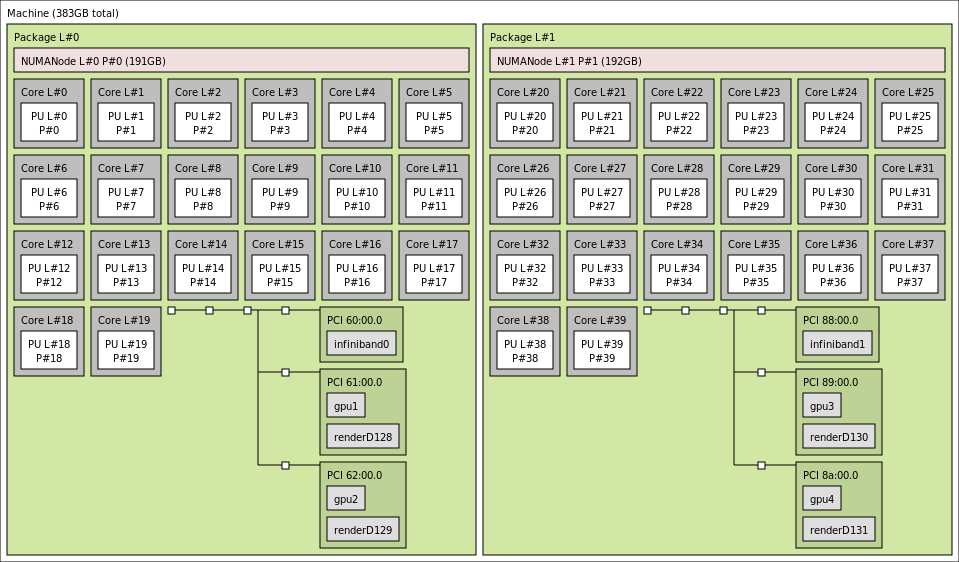

Understanding Puhti GPU nodes
=============================

.. questions::

   - What hardware is available on Puhti's GPU nodes?
   - How do we organize computational work to go where it should?

.. objectives::

   - Understand that the time to transfer data between compute units is finite
   - Understand that managing the locality of data (and the tasks that use them) is critical for performance

Trends in HPC hardware
----------------------

Most of the compute performance in new clusters and supercomputers
will be made available in the form of GPUs that accompany the
CPUs. Many applications, including GROMACS, have been ported to run on
GPUs. The dominant GPU vendor in HPC is Nvidia, and their CUDA
programming framework is close to ubiquitous in HPC applications like
GROMACS. Recently, AMD and Intel have both won major contracts around
the world to deliver GPU-enabled machines (e.g LUMI supercomputer at CSC,
https://www.lumi-supercomputer.eu/). So the future will be interesting. 

All such machines have the same general characteristics. There are
many CPU cores, perhaps separated into a few sockets. There are a
handful of GPUs, each with thousands of cores less powerful than the
CPU cores. The GPUs are able to transfer data to nearby parts of the
CPU, or to other GPUs.

Puhti GPU nodes
---------------

In this workshop we will focus on the GPU nodes of the supercomputer
Puhti, located at CSC in Finland (see
https://docs.csc.fi/computing/overview/). It has 80 nodes with GPUs,
and there are 4 GPUs on each node. Like nearly all modern hardware, it
is built around the notion of *non-uniform memory access* (NUMA). Some
parts of the memory are closer to a particular core than any other.
To get best performance, users and programmers need to make sure that
tasks are allocated to cores and GPUs that prefer the same memory.

   Slightly simplified output of ``lstopo`` on a Puhti GPU node. The
   40 cores and 4 gpus are divided evenly across 2 sockets. Compute
   resources in one socket are closer together than they are to
   resources in the other socket.

.. challenge:: 1.1 Quiz: Which range of CPU cores would be least
   effective to use in work related to gpu2?

   1. Cores 0-9
   2. Cores 10-19
   3. Cores 0-19
   4. Cores 20-39

.. solution::

   4. Cores 20-39 in NUMANode 1 would prefer to use different memory
      than ``gpu2``. Data transfer will be less efficient.

Running jobs on Puhti
---------------------

When requesting GPU nodes on Puhti, a number of CPUs and GPUs are
requested. The SLURM job scheduler is capable of quite complex
assignments, but today we'll keep it simple and focus solely on jobs
that have one or more GPUs and matching groups of 10 CPU cores.

For example (adapted from
https://docs.csc.fi/computing/running/example-job-scripts-puhti/#single-gpu)
to get a single GPU, 10 nearby CPU cores and some memory for 20
minutes using the project for this workshop, we could use a job script
like

.. code-block:: bash

   #!/bin/bash

   #SBATCH --time=00:15:00
   #SBATCH --partition=gpu
   #SBATCH --ntasks=1
   #SBATCH --cpus-per-task=10
   #SBATCH --gres=gpu:v100:1
   #SBATCH --account=project_2003752
   #SBATCH --reservation=gmx3

   module purge
   module load gromacs-env/2021-gpu
   export OMP_NUM_THREADS=$SLURM_CPUS_PER_TASK

   srun gmx_mpi mdrun

If that was in a file ``run-script.sh`` then we can submit it to the
Puhti batch queue with ``sbatch run-script.sh``. For this workshop,
that will start quickly because we have a dedicated reservation.

See also
--------

* https://docs.csc.fi/computing/running/getting-started/

.. keypoints::

   - HPC nodes have internal structure that affects performance
   - Expect to see many clusters that have multiple GPUs per node
