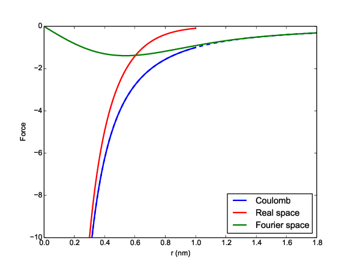
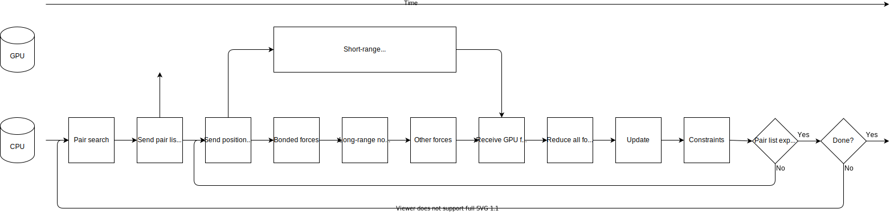
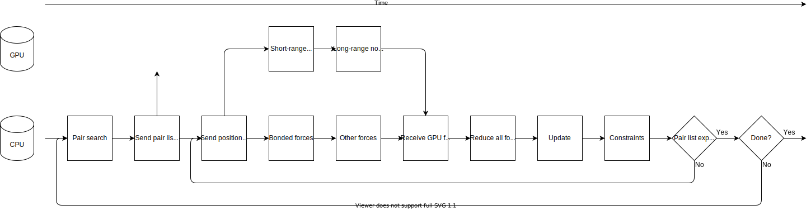
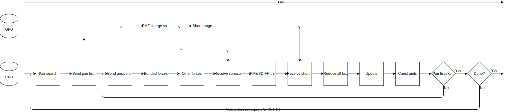
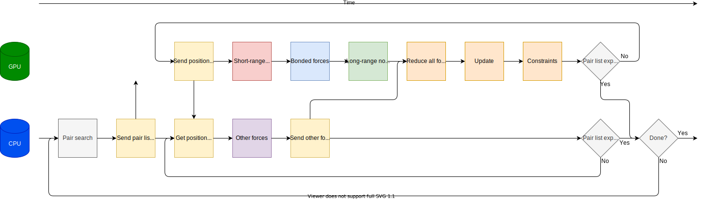

Performant PME simulations
==========================

.. questions::

   - What considerations are important when using PME

.. objectives::

   - Know how to assign the PME workload

Background on the PME algorithm
-------------------------------

Most systems of interest in biomolecular MD have inhomogeneous
distributions of partially charged particles. It turns out that simply
neglecting interactions beyond a cut-off is not accurate enough. Even
extremely large cut-offs only reduce the size, not eliminate
truncation artefacts. Instead, most turn to some form of the Ewald
method, where the shape of the short-range interaction is modified,
and a compensating fix is made by doing extra work in a concurrent
long-range component.

   Decomposing the Coulomb interaction (blue) into short- and
   long-ranged contributions. A Gaussian potential is subtracted from
   the :math:`\frac{1}{r}` Coulomb potential so that its forces (red)
   goes to zero at smaller :math:`r`. That Gaussian is added back in
   the so-called long-range ("PME") component (green) so that the full
   all-vs-all Coulomb interaction is modelled accurately. The
   advantage is that the long-range component is smoothly varying and
   can be efficiently computed with a 3D-FFT.

That concurrent force work can also be computed on the CPU or the GPU.
When run on an Nvidia GPU, the CUFFT library is used to implement the
3D-FFT part of the long-range component. When run on the CPU, a similar
library is used, normally MIT's FFTW or Intel's MKL.

PME tuning
----------

One of the most useful attributes of the PME algorithm is that the
share of the computational work of the two components can be
varying. Scaling the short-ranged cutoff and the 3D-FFT grid spacing
by the same factor gives a model that is just as accurate an
approximation, while reducing the workload of one and increasing the
workload of the other. So the user input can be used to define the
expected quality of the electrostatic approximation, and the actual
implementation can do something equivalent that minimizes the total
execution time.

The PME tuning is on by default whenever it is likely to be useful,
can be forced on with ``gmx mdrun -tunepme``, and forced off with
``gmx mdrun -notunepme``.  In practice, ``mdrun`` does such tuning in
the first few thousand steps, and then uses the result of the
optimization for the remaining time.

.. challenge:: 3.1 Quiz: mdrun also has to compute the van der Waals
   interactions between particles. Should the cutoff for those be changed
   to match the tuned electrostatic cutoff

   1. Yes, keep it simple
   2. Yes, van der Waals interactions are not important
   3. No, they're so cheap it doesn't matter
   4. No, the van der Waals radii are critical for force-field accuracy

.. solution::

   4. Changing the van der Waals cutoff unbalances the force field,
      because the parameters for different interactions are optimized
      in context with each other. Even making it *longer* can upset
      the balance. So in the PME tuning, ``mdrun`` must preserve the
      cutoff for van der Waals. This means PME tuning to short
      electrostatic cutoffs is a less effective option, because the
      pair lists must always be large enough for the van der
      Waals. But typically that possibility was not interesting for
      performance anyway.

MD workflows using PME
----------------------

   Typical GROMACS simulation running on a GPU, with only the short-ranged
   interactions offloaded to the GPU. This can be
   selected with ``gmx mdrun -nb gpu -pme cpu -bonded cpu``.

.. challenge:: 3.2 Quiz: When would it be most likely to benefit
               from moving PME interactions to the GPU?

   1. Few bonded interactions and relatively weak CPU
   2. Few bonded interactions and relatively strong CPU
   3. Many bonded interactions and relatively weak CPU
   4. Many bonded interactions and relatively strong CPU

.. solution::

   3. Running two tasks on the GPU again adds overhead there, and that
      offsets any benefit from speeding up the total work by running
      it on the GPU. If the CPU is powerful enough to finish all its
      work before the GPU finishes the short-ranged work, then
      leaving the PME work on the CPU is best.

The PME task can be moved to the same GPU as the short-ranged
task. This comes with the same kinds of challenges as moving the
bonded task to the GPU.

   Possible GROMACS simulation running on a GPU, with both
   short-ranged and PME tasks offloaded to the GPU. This can be
   selected with ``gmx mdrun -nb gpu -pme gpu -bonded cpu``.

It turns out that the latter part of the PME task is harder to make
run fast on a GPU than the first part, particularly when there is a
short-ranged task also running on the same GPU. GROMACS permits that
second part to be run on the CPU instead.

   Possible GROMACS simulation running on a GPU, with short-ranged and
   the first part of the PME task offloaded to the GPU. This can be
   selected with ``gmx mdrun -nb gpu -pme gpu -pmefft cpu -bonded
   cpu``.

.. challenge:: Explore performance with PME

   In the tarball you unpacked earlier is a subdirectory
   ``pme``. Change to that directory.

   In it, you will find a ``topol.tpr`` run input file prepared to do
   60000 steps of a PME simulation. We'll use it to experiment with
   task assignment.

   Open the ``script.sh`` file where you will see several lines
   marked ``**FIXME**``. Remove the ``**FIXME**`` to achieve the
   goal stated in the comment before that line. You will need to refer
   to the information above to achieve that. Save the file and exit.

   Submit the script to the SLURM job manager with ``sbatch
   script.sh``. It will reply something like ``Submitted batch job
   4565494`` when it succeeded. The job manager will write terminal
   output to a file named like ``slurm-4565494.out``. It may take a
   few minutes to start and a few more minutes to run.

   Run ``squeue -u trainingXXX`` where ``XXX`` is replaced by the
   3-digit number of your account. When your job is running, it will
   have an "R" in the "STATUS" column.
   
   While it is running, you can use ``tail -f slurm*out`` to watch the
   output. When it says "Done" then the runs are finished. Use Ctrl-C
   to exit the ``tail`` command that you ran.

   Once the first trajectory completes, exit ``tail`` and use ``less
   default.log`` to inspect the output. Find the "Mapping of GPU
   IDs..." Does what you read there agree with what you just learned?

   Then, find where the PME tuning took place. Hint: search for "pme
   grid". Write in HackMD what cutoff and number of grid points it
   chose for you for each run. Is it different between each run? Is
   that different from what other people see? What does that tell you
   about mdrun performance on this machine?
   
   The ``*.log`` files contain the performance (in ns/day) of each run
   on the last line. Use ``tail *log`` to see the last chunk of each
   log file. Write a line in HackMD with your name and the performance
   you got, like ``Jane: Default/NB/NB-and-PME/NB-and-firstPME = 94/46/95/65``
   Do your numbers look similar to the others? Have a look through the
   log files and see what you can learn. Ask questions about what you
   don't understand while you have experts around to guide you!

Running update and constraints on the GPU
-----------------------------------------

   Possible GROMACS simulation running on a GPU, with short-ranged and

See also
--------

.. keypoints::

   - The PME workload can be run on a GPU in a few different ways
   - The relative strength of CPU and GPU and the simulation system
     determines the most efficient way to assign the tasks. The
     default is not always best.
