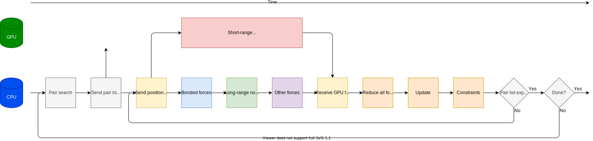

Performant PME simulations
==========================

.. questions::

   - What considerations are important when using PME
   - TODO

.. objectives::

   - Know how to assign the PME workload
   - TODO

Background on the PME algorithm
-------------------------------

Most systems of interest in biomolecular MD have inhomogeneous
distributions of partially charged particles. It turns out that simply
neglecting interactions beyond a cut-off is not accurate enough. Even
extremely large cut-offs only reduce the size, not eliminate
truncation artefacts. Instead, most turn to some form of the Ewald
method, where the shape of the short-range interaction is modified,
and a compensating fix is made by doing extra work in a concurrent
long-range component.

.. figure:: img/ewald-corrected-force.svg
   :align: center

   Decomposing the Coulomb interaction (blue) into short- and
   long-ranged contributions. A Gaussian potential is subtracted from
   the :math:`\frac{1}{r}` Coulomb potential so that its forces (red)
   goes to zero at smaller :math:`r`. That Gaussian is added back in
   the so-called long-range ("PME") component (green) so that the full
   all-vs-all Coulomb interaction is modelled accurately. The
   advantage is that the long-range component is smoothly varying and
   can be efficiently computed with a 3D-FFT.

That concurrent force work can also be computed on the CPU or the GPU.
When run on an Nvidia GPU, the CUFFT library is used to implement the
3D-FFT part of the long-range component. When run on the CPU, a similar
library is used, normally MIT's FFTW or Intel's MKL.

PME tuning
----------

One of the most useful attributes of the PME algorithm is that the
share of the computational work of the two components can be
varying. Scaling the short-ranged cutoff and the 3D-FFT grid spacing
by the same factor gives a model that is just as accurate an
approximation, while reducing the workload of one and increasing the
workload of the other. So the user input can be used to define the
expected quality of the electrostatic approximation, and the actual
implementation can do something equivalent that minimizes the total
execution time.

In practice, ``mdrun`` does such tuning in the first few thousand
steps, and then uses the result for the remaining time. It is on by
default whenever it is likely to be useful, can be forced on with
``gmx mdrun -tunepme``, and forced off with ``gmx mdrun -notunepme``.

.. challenge:: 1.1 Quiz: ``mdrun`` also has to compute the van der Waals
   interactions between particles. Should the cutoff for those be changed
   to match the tuned electrostatic cutoff

   1. Yes, keep it simple
   2. Yes, van der Waals interactions are not important
   3. No, they're so cheap it doesn't matter
   4. No, the van der Waals radii are critical for force-field accuracy

.. solution::

   4. Changing the van der Waals cutoff 

MD workflows using PME
----------------------

   Typical GROMACS simulation running on a GPU, with only the short-ranged
   interactions offloaded to the GPU. This can be
   selected with ``gmx mdrun -nb gpu -pme cpu -bonded cpu``.

.. challenge:: 1.1 Quiz: When would it be most likely to benefit
               from moving PME interactions to the GPU?

   1. Few bonded interactions and relatively weak CPU
   2. Few bonded interactions and relatively strong CPU
   3. Many bonded interactions and relatively weak CPU
   4. Many bonded interactions and relatively strong CPU

.. solution::

   3. Running two tasks on the GPU again adds overhead there, and that
      offsets any benefit from speeding up the total work by running
      it on the GPU. If the CPU is powerful enough to finish all its
      work before the GPU finishes the short-ranged work, then
      leaving the PME work on the CPU is best.

.. figure:: img/molecular-dynamics-workflow-short-range-gpu-pme-gpu-bonded-cpu.svg
   :align: center

   Possible GROMACS simulation running on a GPU, with both
   short-ranged and PME tasks offloaded to the GPU. This can be
   selected with ``gmx mdrun -nb gpu -pme gpu -bonded cpu``.

It turns out that the latter part of the PME task is harder to make
run fast on a GPU than the first part, particularly when there is a
short-ranged task also running on the same GPU. GROMACS permits that
second part to be run on the CPU instead.

.. figure:: img/molecular-dynamics-workflow-short-range-gpu-pme-gpu-pmefft-cpu-bonded-cpu.svg
   :align: center

   Possible GROMACS simulation running on a GPU, with short-ranged and
   the first part of the PME task offloaded to the GPU. This can be
   selected with ``gmx mdrun -nb gpu -pme gpu -pmefft cpu -bonded
   cpu``.

TODO exercise trying PME in different ways

See also
--------

.. keypoints::

   - The PME workload can be run on a GPU in a few different ways
   - The relative strength of CPU and GPU
